# PhaseFlow: Bidirectional Generation of Protein Sequences and Phase Diagrams for LLPS

<p align="center">
  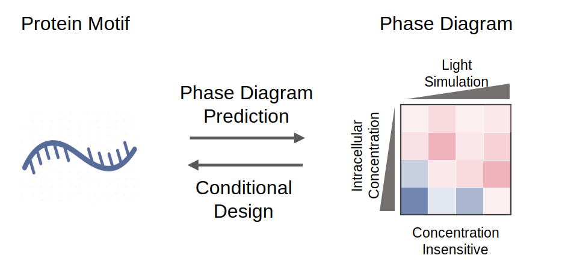
</p>

**PhaseFlow** is a unified generative model for protein liquid-liquid phase separation (LLPS) that jointly models amino acid sequences and 4×4 PSSI phase diagrams. Each phase diagram encodes PSSI (Phase Separation Score Index) values across a **4×4 grid of light intensities × protein concentrations**, capturing the full phase behavior of a sequence under varying experimental conditions. Built on a Transfusion-style Transformer backbone with Flow Matching, it enables both **sequence → phase diagram prediction** and **phase diagram → sequence design** in a single model.

---

## Table of Contents

- [Overview](#overview)
- [Model Architecture](#model-architecture)
- [Key Innovations](#key-innovations)
  - [Hybrid Architecture](#1-hybrid-architecture-transformer--flow-matching)
  - [Training Innovations](#2-training-innovations)
  - [Inference-Time Optimization](#3-inference-time-optimization)
- [Applications](#applications)
  - [Conditional De Novo Protein Design](#conditional-de-novo-protein-design)
  - [Directed Evolution](#directed-evolution)
- [Installation](#installation)
- [Usage](#usage)
- [Citation](#citation)

---

## Overview

Protein liquid-liquid phase separation (LLPS) underlies many biological processes, from stress granule formation to biomolecular condensate assembly. Designing proteins with tailored phase behavior requires navigating a high-dimensional sequence space while satisfying complex, multi-condition phase constraints.

PhaseFlow addresses this challenge by:
- **Predicting** full 4×4 PSSI phase diagrams from arbitrary protein sequences
- **Designing** novel sequences conditioned on target phase diagrams
- **Optimizing** existing sequences toward desired phase properties via directed evolution

---

## Model Architecture

<p align="center">
  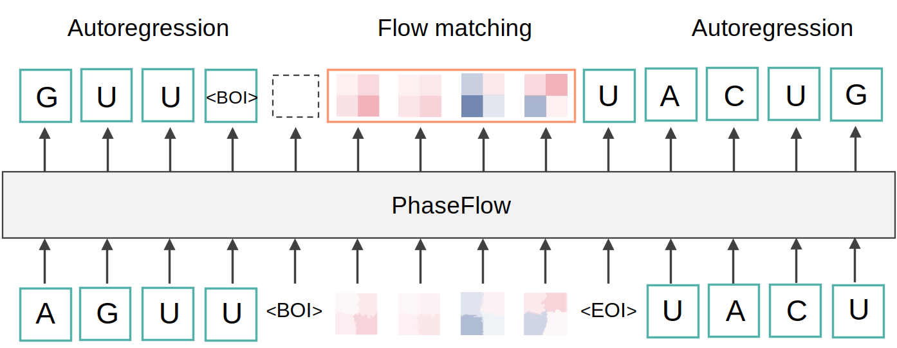
</p>

PhaseFlow is built on a unified Transformer backbone (~7M parameters) that processes sequences and phase diagrams as interleaved token streams:

```
[SOS] [AA sequence tokens] [EOS] [META] [shape] [SOM] [16 phase tokens] [EOM] [EOS]
```

| Component | Details |
|---|---|
| **Backbone** | 6-layer Transformer, dim=256, 8 heads, RoPE positional encoding, SwiGLU FFN |
| **Phase Encoder** | `SetPhaseEncoder`: each of the 16 PSSI values (4 light intensities × 4 protein concentrations) independently encoded as a token; missing values masked |
| **Sequence → Phase** | Flow Matching head (CondOT path); generates phase diagram via ODE solver |
| **Phase → Sequence** | Autoregressive language model head; conditioned on phase token context |

---

## Key Innovations

### 1. Hybrid Architecture: Transformer + Flow Matching

PhaseFlow unifies two fundamentally different tasks—**discrete sequence generation** (language modeling) and **continuous phase diagram prediction** (generative modeling)—within a single Transformer. This is achieved by adapting the [Transfusion](https://arxiv.org/abs/2408.11039) framework to the LLPS domain.

- The **language model head** handles autoregressive generation of amino acid tokens
- The **Flow Matching head** predicts the velocity field `v(x, t)` for continuous PSSI values, generating phase diagrams via ODE integration
- Both tasks share the same Transformer backbone, enabling rich cross-modal representations

This joint training paradigm means the model learns the underlying relationship between sequence composition and phase behavior rather than treating them as independent problems.

### 2. Training Innovations

#### Joint Training Outperforms Single-Task Models

<p align="center">
  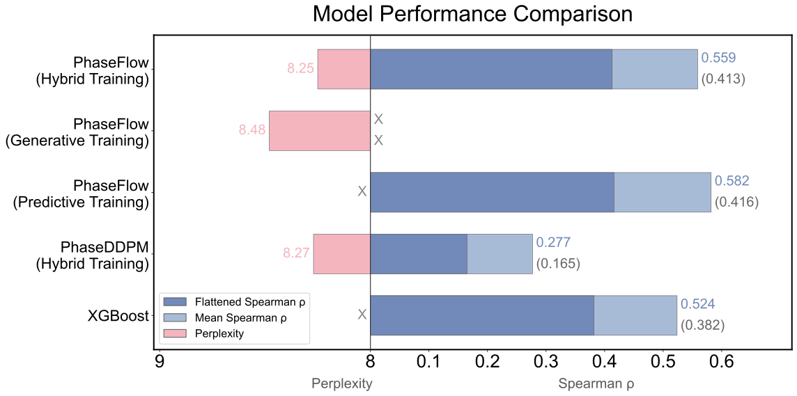
</p>

Training the sequence and phase diagram tasks jointly in a single model consistently outperforms training dedicated single-task models, demonstrating that the two modalities provide complementary supervisory signals to the shared backbone.

#### Flow Matching Outperforms DDPM

<table>
  <tr>
    <td align="center"><b>DDPM</b></td>
    <td align="center"><b>Flow Matching</b></td>
  </tr>
  <tr>
    <td>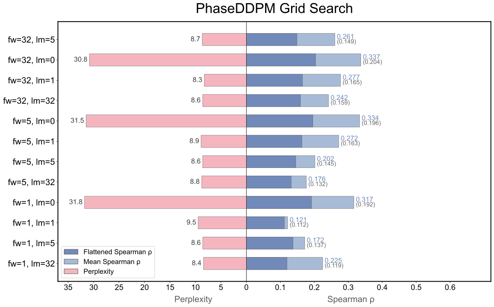</td>
    <td>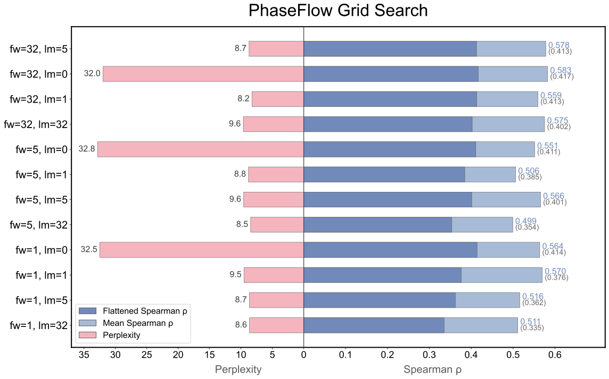</td>
  </tr>
</table>

Replacing the original DDPM diffusion module with **Conditional Optimal Transport Flow Matching** (CondOT) substantially improves phase diagram generation quality. Flow Matching uses straight-line interpolation paths `x_t = (1-t)·x₀ + t·x₁` with velocity target `v = x₁ - x₀`, which are easier to learn and better calibrated for the PSSI value range.

#### Noisy High-Throughput Data Still Helps

<p align="center">
  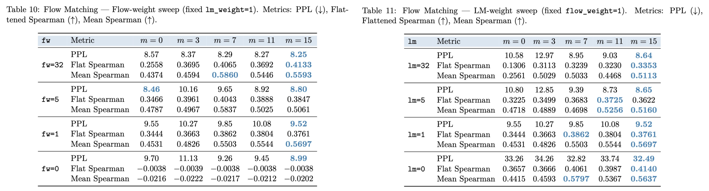
</p>

High-throughput LLPS assays inevitably produce noisy measurements. Rather than filtering aggressively, we show that including noisier samples (sequences with more missing PSSI conditions) consistently improves model performance. The model learns robust phase-sequence associations even from incomplete observations.

#### Adaptive Loss Weighting by Phase Diagram Coverage

<p align="center">
  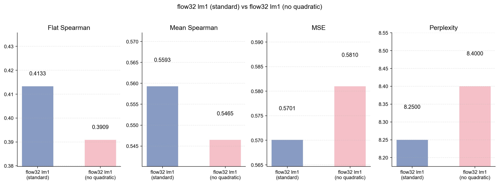
</p>

The balance between the Flow Matching loss and the language model loss is tuned according to the information content of the phase diagram. Weighting the mixed loss proportionally to the observed fraction of the 4×4 grid further improves prediction accuracy, especially for sequences with partially-observed phase diagrams.

### 3. Inference-Time Optimization

<p align="center">
  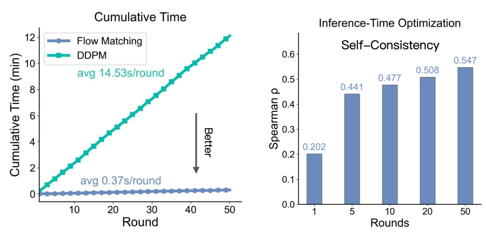
</p>

At inference time, PhaseFlow supports **self-consistency optimization**: given a generated sequence, the model re-predicts its phase diagram and iteratively refines the sequence to minimize the discrepancy between the target and predicted phase conditions. This cycle-consistent refinement enhances the reliability of designed sequences.

Additionally, Flow Matching inference via an ODE solver is **significantly faster** than DDPM's iterative reverse diffusion, reducing per-sample generation time by an order of magnitude without sacrificing quality.

---

## Applications

### Conditional De Novo Protein Design

PhaseFlow generates entirely novel protein sequences conditioned on user-specified target phase diagrams.

<p align="center">
  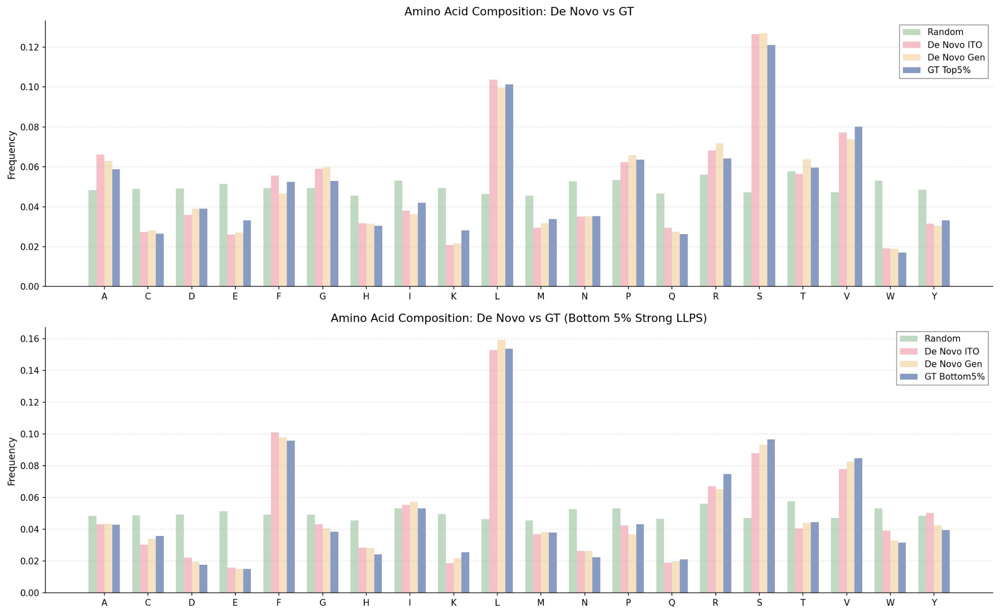
</p>

The amino acid composition of PhaseFlow-designed sequences reflects genuine phase-separation signatures: sequences designed for high PSSI targets are enriched in aromatic and hydrophobic residues, consistent with known LLPS drivers.

<p align="center">
  <b>Top-5 High-PSSI Designs</b><br/>
  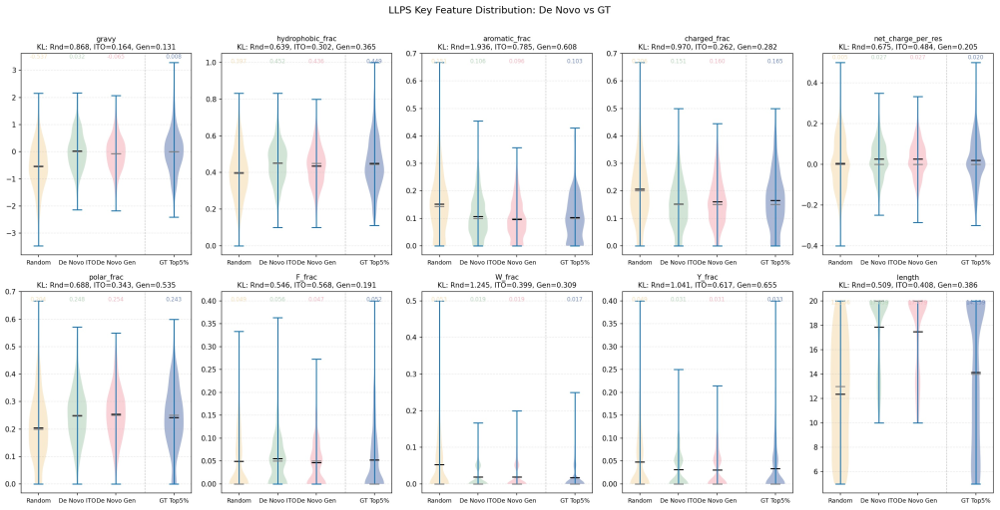
</p>

<p align="center">
  <b>Bottom-5 Low-PSSI Designs</b><br/>
  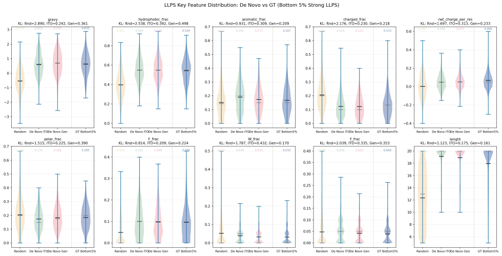
</p>

Top-ranking designs show concentrated, high-PSSI phase diagrams with clear light/high concentration boundaries, while low-ranking designs exhibit the expected low-PSSI profiles—demonstrating that the model learns meaningful sequence-to-phase relationships.

### Directed Evolution

<p align="center">
  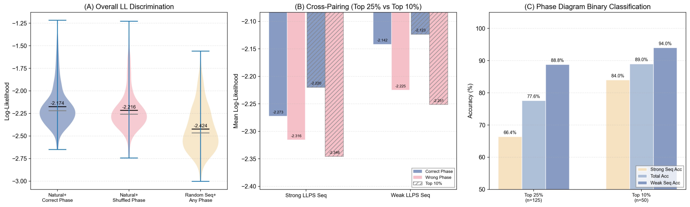
</p>

PhaseFlow guides **in silico directed evolution** by leveraging the **language model likelihood** of the sequence conditioned on a target phase diagram. Concretely, given a target phase condition, the LM head computes `log P(sequence | phase diagram)`—a score that measures how well a sequence is compatible with the specified phase behavior. Mutations that increase this conditional likelihood are preferentially selected, directly steering the evolutionary trajectory toward the desired phase properties.

Starting from a seed sequence, the workflow proceeds as:
1. **Enumerate** single or combinatorial mutations of the parent sequence
2. **Score** each variant by computing `log P(mutant | target phase diagram)` using the PhaseFlow LM head
3. **Select** top-ranked variants as parents for the next round
4. **Iterate** until convergence or a desired fitness threshold is reached

Because the phase diagram serves as the conditioning signal, the evolutionary direction is explicitly guided by the target LLPS profile rather than by sequence similarity or generic fitness proxies. This enables rational, property-directed optimization without additional wet-lab experiments at each round.

---

## Installation

```bash
git clone https://github.com/your-org/PhaseFlow.git
cd PhaseFlow

# Create and activate conda environment
conda env create -f environment.yml
conda activate phaseflow
```

Or install dependencies via pip:

```bash
pip install -r requirements.txt
```

---

## Usage

### Training

```bash
# Flow Matching (recommended)
bash scripts/train.sh -c config/bs2048_lr0.0008_flow32_20260123.yaml -g 0

# DDPM (for ablation)
bash scripts/train.sh -c config/set_ddpm_cosine_missing15.yaml -g 0
```

Key training arguments:

| Flag | Description | Example |
|---|---|---|
| `-c, --config` | Config YAML path | `config/set_flow32_missing15.yaml` |
| `-g, --gpu` | GPU ID | `0` |
| `-b, --batch` | Override batch size | `2048` |
| `-l, --lr` | Override learning rate | `0.0008` |
| `-e, --epochs` | Override epochs | `200` |

### Sequence → Phase Diagram Prediction

```python
import torch
from phaseflow import PhaseFlow, AminoAcidTokenizer

checkpoint = torch.load('outputs_set/output_set_flow32_missing15/best_model.pt')
config = checkpoint['config']

model = PhaseFlow(**config['model'], dropout=0.0)
model.load_state_dict(checkpoint['model_state_dict'])
model.eval()

tokenizer = AminoAcidTokenizer()
sequence = "ACDEFGHIKLMNPQRSTVWY"
tokens = tokenizer.build_input_sequence(sequence)
input_ids = torch.tensor([tokenizer.pad_sequence(tokens, 32)])
attention_mask = (input_ids != tokenizer.PAD_ID).long()
seq_len = torch.tensor([len(sequence)])

with torch.no_grad():
    pred_phase = model.generate_phase(
        input_ids, attention_mask, seq_len,
        method='euler'   # or 'dopri5'
    )
print("Predicted PSSI:", pred_phase)
```

### Phase Diagram → Sequence Design

```python
import torch
from phaseflow import PhaseFlow, AminoAcidTokenizer

# Load model (same as above)

# Define target phase diagram (16 PSSI values: 4 light intensities × 4 protein concentrations)
phase = torch.tensor([[2.0, 1.8, 1.5, 1.2,
                        1.9, 1.7, 1.4, 1.1,
                        1.6, 1.4, 1.1, 0.8,
                        1.2, 1.0, 0.7, 0.4]])
phase_mask = torch.ones(1, 16)

with torch.no_grad():
    tokens, sequences = model.generate_sequence(
        phase, tokenizer,
        max_len=32,
        temperature=1.0,
        top_k=40,
        top_p=0.9,
    )
print("Designed sequence:", sequences[0])
```

---

## Citation

If you use PhaseFlow in your research, please cite:

```bibtex
@article{phaseflow2026,
  title   = {PhaseFlow: Bidirectional Generation of Protein Sequences and Phase Diagrams for Liquid-Liquid Phase Separation},
  author  = {},
  journal = {},
  year    = {2026}
}
```
