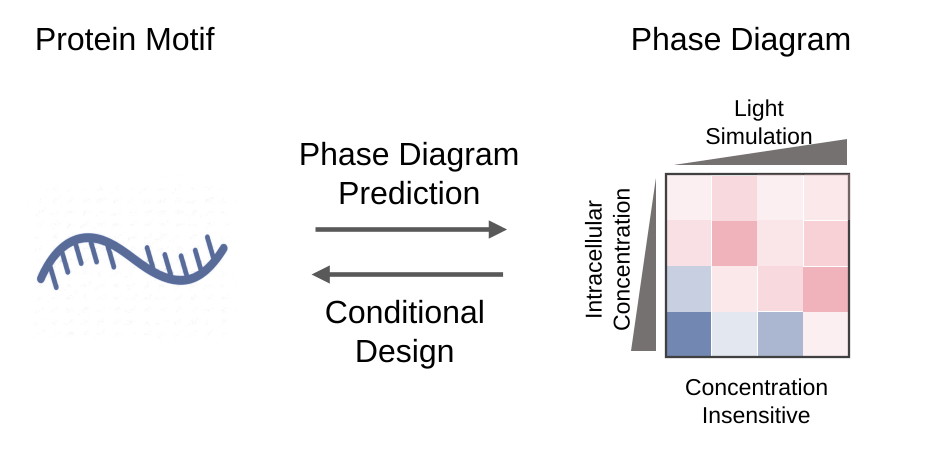
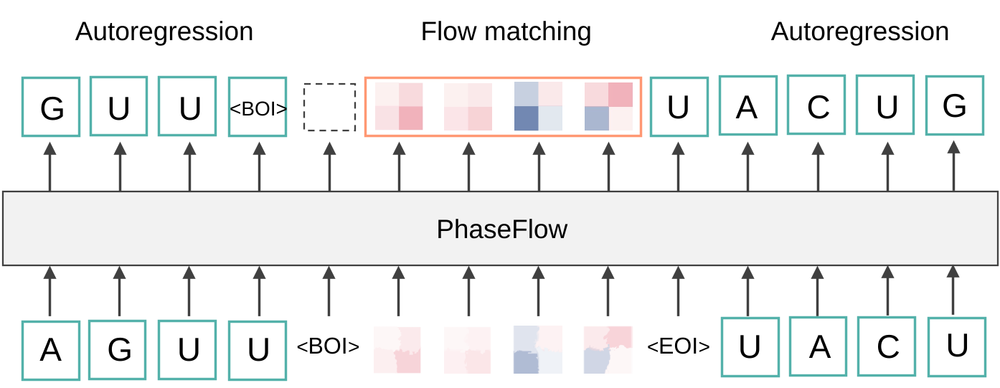

# PhaseFlow

PhaseFlow is a research codebase for bidirectional modeling between protein amino-acid
sequences and 4x4 LLPS phase diagrams. The model combines a Transformer backbone with
Flow Matching for sequence-to-phase prediction and conditional language modeling for
phase-to-sequence design.

<p align="center">
  
</p>

## Repository Layout

```text
phaseflow/      Core Python package: model, tokenizer, data loading, utilities
configs/        Versioned experiment configurations
experiments/    Training, evaluation, and generation entrypoints
scripts/        Shell launchers for common workflows
analyses/       Paper and supplemental analysis scripts
figures/        Curated figures used by README and reports
docs/           Technical notes and extended documentation
examples/       Small runnable examples and demo inputs
tests/          Lightweight smoke tests
data/           Data documentation and optional small examples
results/        Small curated result artifacts
archive/        Historical outputs kept for traceability
```

## Installation

```bash
conda env create -f environment.yml
conda activate phaseflow
pip install -e .
```

Alternatively:

```bash
pip install -r requirements.txt
pip install -e .
```

## Data

Training CSV files are expected to contain:

- `AminoAcidSequence`
- `group_11` through `group_44`, representing the 4x4 PSSI phase diagram

Large datasets are intentionally not committed. See `data/README.md` for layout details.

## Training

```bash
bash scripts/train.sh \
  --config configs/default.yaml \
  --data /path/to/phase_diagram_original_scale.csv \
  --val /path/to/val_set.csv \
  --test /path/to/test_set.csv \
  --gpu 0
```

The launcher writes logs to `logs/` and checkpoints to `outputs/` by default. To run in the
foreground:

```bash
bash scripts/train.sh --foreground --data /path/to/phase_diagram_original_scale.csv
```

You can also call the Python entrypoint directly:

```bash
python experiments/train.py \
  --config configs/default.yaml \
  --data_path /path/to/phase_diagram_original_scale.csv \
  --val_path /path/to/val_set.csv \
  --test_path /path/to/test_set.csv
```

## Inference

Predict phase diagrams from a text file of sequences:

```bash
bash scripts/infer.sh outputs/run_xxx/best_model.pt examples/sequences.txt results/predicted_phases.csv 0
```

Or call the Python entrypoint:

```bash
python experiments/predict_seq2phase.py \
  --checkpoint outputs/run_xxx/best_model.pt \
  --input_file examples/sequences.txt \
  --output results/predicted_phases.csv
```

Generate sequences from target phase diagrams:

```bash
python examples/phase2seq_demo.py \
  --checkpoint outputs/run_xxx/best_model.pt \
  --input_csv /path/to/test_set.csv
```

## Evaluation

```bash
python experiments/evaluate_seq2phase.py \
  --test_path /path/to/test_set.csv \
  --models_dir outputs_set

python experiments/evaluate_phase2seq.py \
  --test_path /path/to/test_set.csv \
  --train_path /path/to/phase_diagram_original_scale.csv \
  --models_dir outputs_set
```

Evaluation summaries are written to `results/evaluation/` unless overridden.

## Model Overview

<p align="center">
  
</p>

For detailed architecture notes, analysis summaries, and historical project notes, see `docs/`.

## Development Checks

```bash
python -m compileall phaseflow experiments analyses examples tests
python -m unittest discover tests
```
