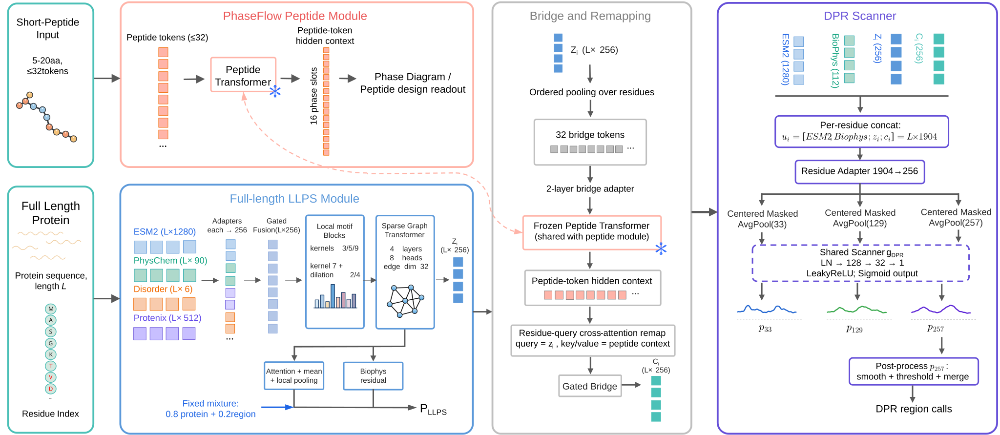

# PhaseFlow: Multi-Scale Modeling and Design of Phase-Separating Proteins

<div align="center">
  
</div>

<div align="center">


</div>

<div align="center"><i>A unified PhaseFlow codebase for peptide phase diagrams, full-length LLPS prediction, DPR localization, and mutation-effect scoring.</i></div>

<br>

## Why Use PhaseFlow?

<table>
  <tr>
    <td><b>Multi-scale LLPS modeling</b></td>
    <td>Covers short-peptide phase diagrams, full-length protein LLPS, DPR localization, and mutation-effect scoring.</td>
  </tr>
  <tr>
    <td><b>Bidirectional peptide model</b></td>
    <td>Learns mappings between amino-acid sequences and 4x4 phase-separation score index (PSSI) diagrams.</td>
  </tr>
  <tr>
    <td><b>Flow Matching for phase diagrams</b></td>
    <td>Supports faster phase-conditioned peptide design loops than diffusion-style sampling.</td>
  </tr>
  <tr>
    <td><b>Full-length LLPS and DPR scanning</b></td>
    <td>Predicts protein-level LLPS propensity and localizes droplet-promoting regions from residue context.</td>
  </tr>
  <tr>
    <td><b>Staged transfer bridge</b></td>
    <td>Transfers short-peptide sequence-phase knowledge to full-length proteins through 32 ordered bridge tokens.</td>
  </tr>
  <tr>
    <td><b>Mutation-effect scoring</b></td>
    <td>Amino-acid perturbations can be scored for predicted shifts in phase-separation behavior.</td>
  </tr>
  <tr>
    <td><b>Rich protein features</b></td>
    <td>Combines ESM2, physicochemical, disorder, Protenix-derived, graph, and residue-context signals.</td>
  </tr>
  <tr>
    <td><b>Artifact-ready layout</b></td>
    <td>Code, configs, docs, figures, local datasets, and local model downloads are separated so GitHub stays lightweight while Hugging Face artifacts can be added cleanly.</td>
  </tr>
</table>

<br>

## Key Modules

| Module | Path | Description |
| --- | --- | --- |
| Peptide core package | `phaseflow/` | Tokenizer, peptide Transformer, Flow Matching/DDPM model, utilities |
| Full-length package | `phaseflow/full_length/` | Full-length data loading, feature builders, LLPS/DPR models, losses, metrics, inference helpers |
| Peptide configs | `configs/peptide/` | Lightweight peptide training defaults |
| Full-length configs | `configs/full_length/` | Final LLPS and DPR configuration summaries |
| Peptide scripts | `scripts/peptide/` | Training, inference, resume, and experiment launchers |
| Full-length scripts | `scripts/full_length/` | Data construction, teacher wrappers, training, evaluation, and benchmark utilities |
| Examples | `examples/` | Small peptide demo inputs and phase-to-sequence example |
| Tests | `tests/` | Peptide smoke tests and focused full-length tests |
| Figures | `figures/` | Curated README and paper-result figures |
| Research workflows | `research/` | Short-peptide experiments and analysis scripts |
| Local artifacts | `artifacts/` | Placeholder for local datasets, model downloads, and curated result artifacts |

<br>

<details>
<summary><kbd>Table of Contents</kbd></summary>

<br>

- [Quick Start](#quick-start)
- [Installation](#installation)
- [Repository Layout](#repository-layout)
- [Models And Datasets](#models-and-datasets)
- [Short-Peptide Usage](#short-peptide-usage)
- [Full-Length Usage](#full-length-usage)
- [Evaluation And Checks](#evaluation-and-checks)
- [Input And Output Formats](#input-and-output-formats)
- [Artifact Policy](#artifact-policy)
- [Key Results](#key-results)
- [Figures](#figures)
- [Citation](#citation)
- [License](#license)

<br>

</details>

<br>

## Quick Start

Install the source package:

```bash
git clone <your-phaseflow-repo-url>
cd PhaseFlow
conda env create -f environment.yml
conda activate phaseflow
python -m pip install -e .
python -c "import phaseflow; print(phaseflow.__version__)"
```

Download models and datasets after the Hugging Face release:

```bash
huggingface-cli download <org/phaseflow-peptide-model> \
  --local-dir artifacts/models/peptide

huggingface-cli download <org/phaseflow-peptide-data> \
  --repo-type dataset \
  --local-dir artifacts/data/peptide
```

Run peptide sequence-to-phase inference:

```bash
bash scripts/peptide/infer.sh \
  artifacts/models/peptide/best_model.pt \
  examples/sequences.txt \
  artifacts/results/peptide/predicted_phases.csv \
  0
```

The Hugging Face repository names above are placeholders until the public
artifact release is finalized.

## Installation

### Local source install

```bash
conda env create -f environment.yml
conda activate phaseflow
python -m pip install -e .
```

Install optional full-length and test dependencies:

```bash
python -m pip install -e ".[full_length,test]"
```

Install optional feature-generation dependencies:

```bash
python -m pip install -e ".[plm,starling]"
```

The default source install is intended for code reuse, peptide workflows, and
lightweight checks. Full-length reproduction requires external data, feature
stores, and model checkpoints that are not committed to Git.

## Repository Layout

```text
phaseflow/                 Short-peptide package and full_length subpackage
phaseflow/full_length/     Full-length LLPS, DPR, feature, metric, and training code
configs/peptide/           Short-peptide configs
configs/full_length/       Final full-length LLPS and DPR configs
docs/peptide/              Short-peptide documentation
docs/full_length/          Full-length documentation and audit reports
scripts/peptide/           Short-peptide training and inference launchers
scripts/full_length/       Full-length data, training, evaluation, and teacher scripts
tests/peptide/             Short-peptide smoke tests
tests/full_length/         Full-length focused tests
examples/                  Short-peptide demo inputs
research/peptide/experiments/  Short-peptide training/evaluation entry points
research/peptide/analyses/     Short-peptide analysis scripts and curated outputs
figures/peptide/           Short-peptide figures
figures/full_length/       Full-length LLPS/DPR figures
artifacts/data/            Local datasets and generated feature stores
artifacts/models/          Local model checkpoints downloaded from Hugging Face
artifacts/results/         Lightweight curated result artifacts
```

## Models And Datasets

Large artifacts are intentionally separated from the source repository.

Suggested local layout:

```text
artifacts/data/
  peptide/                 Phase-diagram CSV/NPZ data and split files
  full_length/             Manifests, feature stores, benchmark inputs
artifacts/models/
  peptide/                 Short-peptide PhaseFlow checkpoints
  full_length/
    llps/                  Full-length LLPS checkpoints
    dpr/                   Full-length DPR checkpoints
```

Planned download pattern after release:

```bash
huggingface-cli download <org/phaseflow-peptide-data> \
  --repo-type dataset \
  --local-dir artifacts/data/peptide

huggingface-cli download <org/phaseflow-full-length-data> \
  --repo-type dataset \
  --local-dir artifacts/data/full_length

huggingface-cli download <org/phaseflow-peptide-model> \
  --local-dir artifacts/models/peptide

huggingface-cli download <org/phaseflow-full-length-models> \
  --local-dir artifacts/models/full_length
```

| Resource | Local target | Status |
| --- | --- | --- |
| Peptide phase-diagram data | `artifacts/data/peptide/` | Hugging Face release pending |
| Full-length feature/data bundle | `artifacts/data/full_length/` | Hugging Face release pending |
| Peptide model checkpoint | `artifacts/models/peptide/` | Hugging Face release pending |
| Full-length LLPS and DPR checkpoints | `artifacts/models/full_length/` | Hugging Face release pending |

## Short-Peptide Usage

### Train

```bash
bash scripts/peptide/train.sh \
  --config configs/peptide/default.yaml \
  --data artifacts/data/peptide/phase_diagram_original_scale.csv \
  --output-dir outputs/peptide \
  --gpu 0 \
  --foreground
```

### Predict phase diagrams from sequences

```bash
bash scripts/peptide/infer.sh \
  artifacts/models/peptide/best_model.pt \
  examples/sequences.txt \
  artifacts/results/peptide/predicted_phases.csv \
  0
```

### Generate sequences from target phase diagrams

```bash
python examples/phase2seq_demo.py \
  --checkpoint artifacts/models/peptide/best_model.pt \
  --input_csv artifacts/data/peptide/test_set.csv \
  --num_samples 5
```

### Evaluate peptide models

```bash
python research/peptide/experiments/evaluate_seq2phase.py \
  --test_path artifacts/data/peptide/test_set.csv \
  --models_dir outputs/peptide
```

## Full-Length Usage

The full-length code is packaged under `phaseflow.full_length`. It expects
downloaded model checkpoints and feature/data bundles under `artifacts/models/full_length/`
and `artifacts/data/full_length/`.

Final released configuration summaries:

- `configs/full_length/final_llps.yaml`
- `configs/full_length/final_dpr.yaml`

### IDR sliding-window peptide PhaseFlow helper

```bash
python scripts/full_length/predict_idr_phaseflow.py \
  --input artifacts/data/full_length/idr_sequences.xlsx \
  --checkpoint artifacts/models/peptide/best_model.pt \
  --output artifacts/results/full_length/idr_phaseflow_profiles.jsonl \
  --csv artifacts/results/full_length/idr_phaseflow_profiles.csv
```

### DPR training entry point

```bash
torchrun --nproc_per_node=8 scripts/full_length/training/run_dpr_v6.py \
  --config configs/full_length/final_dpr.yaml \
  --arm d1_flat \
  --updates 50 \
  --output-root outputs/full_length/dpr_v6
```

This command requires the external full-length feature stores and checkpoints
referenced by the config.

### Manuscript table utilities

```bash
python scripts/full_length/generate_paper_tables.py
python scripts/full_length/generate_tables_pdf.py --task all
```

## Evaluation And Checks

Short-peptide checks:

```bash
python -m compileall phaseflow research/peptide/experiments research/peptide/analyses examples tests/peptide
python -m unittest discover tests/peptide
```

Full-length checks:

```bash
python -m compileall phaseflow/full_length scripts/full_length tests/full_length
python -m pytest tests/full_length/test_imports.py tests/full_length/test_phaseflow_fusion.py
```

Install test dependencies if `pytest` is unavailable:

```bash
python -m pip install -e ".[test]"
```

## Input And Output Formats

### Peptide sequence input

`scripts/peptide/infer.sh` accepts a text file with one amino-acid sequence per
line, or the underlying Python script can read a CSV column named
`AminoAcidSequence`.

```text
ACDEFGHIKLMNPQRSTVWY
GGGGGSSSSSQQQQQNNNNN
```

### Peptide phase output

Sequence-to-phase inference writes a CSV with the sequence and 16 PSSI columns:

```text
AminoAcidSequence,group_11,group_12,...,group_44
ACDEFGHIKLMNPQRSTVWY,0.12,-0.08,...,0.31
```

### Full-length IDR helper output

The IDR helper writes JSONL profiles and an optional compact CSV:

```json
{"id":"IDR_000","length":120,"window_sizes":[20],"pssi_mean":0.14}
```

## Artifact Policy

Git tracks code, configs, docs, tests, and curated lightweight figures/results.
It does not track raw datasets, generated feature stores, model checkpoints,
training logs, or large runtime outputs.

Local artifact paths:

- `artifacts/data/peptide/` and `artifacts/data/full_length/` for datasets and feature stores.
- `artifacts/models/peptide/` and `artifacts/models/full_length/` for Hugging Face model downloads.
- `outputs/` and `logs/` for regenerated training or inference outputs.

The repository `.gitignore` excludes common checkpoint formats such as `.pt`,
`.pth`, `.ckpt`, and `.safetensors`, and also ignores local model files under
`artifacts/models/`.

## Key Results

The values below are summarized from the tracked configs, audit reports, and
figure artifacts in this repository. They are included to make the README
useful as a project entry point; detailed provenance remains in
`configs/full_length/` and `docs/full_length/final/`.

| Task | Evaluation setting | PhaseFlow result |
| --- | --- | --- |
| Full-length LLPS | PPMC full panel | AUPRC 0.752, AUROC 0.874 |
| Full-length LLPS | threshold 0.5 | MCC 0.549, F1 0.676 |
| Peptide phase prediction | complete held-out peptide diagrams | Spearman 0.4168, Pearson 0.4219, MSE 0.5652 |
| Flow Matching vs DDPM | matched peptide phase-grid comparison | mean Spearman 0.559 vs 0.277; MSE 0.570 vs 1.315 |
| DPR localization | PhasePro, p257 readout | residue AUPRC 0.712, top-5 enrichment 1.813 |
| DPR region calling | IoU 0.25 region matching | recall 0.580, precision 0.638, segment F1 0.608 |
| Mutation effects | TDP-43 point-mutation panels | strongest average ranking/classification metrics among compared methods in the included benchmark summary |

## Figures

### Short-Peptide Architecture

<p align="center">
  
</p>

The short-peptide module is the bidirectional sequence-phase model. For
sequence-to-phase prediction, peptide tokens and phase-grid tokens pass through
shared Transformer blocks and a Flow Matching velocity head to predict a 4x4
PSSI diagram. For phase-to-sequence design, the same architecture conditions on
the target phase diagram and uses causal language modeling to generate peptide
sequences.

### Full-Length Protein Architecture

<p align="center">
  
</p>

The full-length module handles protein-scale context separately from the
short-peptide task. It combines residue-level ESM2, physicochemical, disorder,
structure-derived, graph, and local-context features, then bridges peptide
sequence-phase knowledge through ordered bridge tokens and residue-query
cross-attention. The outputs are protein-level LLPS probability and DPR scanner
profiles that are post-processed into droplet-promoting region calls.

### Full-Length LLPS

<table>
  <tr>
    <td align="center" width="50%">
      
      <br><i>Protein-level LLPS benchmark.</i>
    </td>
    <td align="center" width="50%">
      
      <br><i>Input-stream and weak-supervision ablations.</i>
    </td>
  </tr>
</table>

### DPR Localization

<table>
  <tr>
    <td align="center" width="50%">
      
      <br><i>Residue- and region-level DPR benchmark.</i>
    </td>
    <td align="center" width="50%">
      
      <br><i>DPR scanner input and bridge ablations.</i>
    </td>
  </tr>
</table>

<p align="center">
  
  <br><i>Representative DPR profiles on PhasePro proteins.</i>
</p>

### Peptide Phase Prediction And Design

<table>
  <tr>
    <td align="center" width="50%">
      
      <br><i>Flow Matching and DDPM phase-diagram comparison.</i>
    </td>
    <td align="center" width="50%">
      
      <br><i>Phase-conditioned generation and rescoring loop.</i>
    </td>
  </tr>
  <tr>
    <td align="center" width="50%">
      
      <br><i>Generated high-tendency peptide candidates.</i>
    </td>
    <td align="center" width="50%">
      
      <br><i>Generated low-tendency peptide candidates.</i>
    </td>
  </tr>
</table>

### Mutation Effects

<table>
  <tr>
    <td align="center" width="50%">
      
      <br><i>TDP-43 point-mutation benchmark summary.</i>
    </td>
    <td align="center" width="50%">
      
      <br><i>Within-panel W-to-G multi-mutant trend.</i>
    </td>
  </tr>
</table>

## Citation

Citation information will be added after the public manuscript and artifact
release are finalized.

## License

License information is pending. Add the intended `LICENSE` file before public
release or redistribution.
