# PhaseFlow: A Unified Multi-Modal Generative Model for Phase-Separating Proteins

<div align="center">
  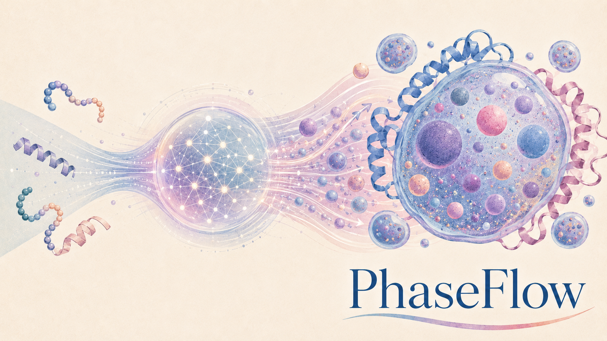
</div>

<div align="center">


</div>

<div align="center"><i>A unified multi-modal generative model that connects amino-acid sequences, phase diagrams, residue context, structure-derived features, protein graphs, LLPS propensity, DPR localization, and mutation-effect scoring.</i></div>

<br>

<p align="center">
  <a href="#quick-start"></a>
  <a href="#installation"></a>
  <a href="http://phaseflow.bio/"></a>
</p>

<br>

## Model Overview

PhaseFlow is organized around one modeling goal: learn how sequence-level,
phase-diagram, and protein-context signals map into phase-separation behavior,
then use those learned mappings for prediction, localization, and design.

| Signal family | Role in PhaseFlow |
| --- | --- |
| Peptide sequence tokens | Sequence-to-phase prediction and phase-conditioned sequence generation |
| 4x4 PSSI phase diagrams | Compact representation of phase-separation score landscapes |
| Flow Matching and causal language modeling | Fast phase-diagram regression and target-conditioned peptide design |
| Protein residue context | Protein-level LLPS prediction and residue-level DPR scanning |
| ESM2, physicochemical, disorder, structure, graph, and local-context features | Multi-modal protein representations for protein tasks |
| Ordered bridge tokens | Transfer short-peptide sequence-phase knowledge into protein modeling |

## Application

<p align="center">
  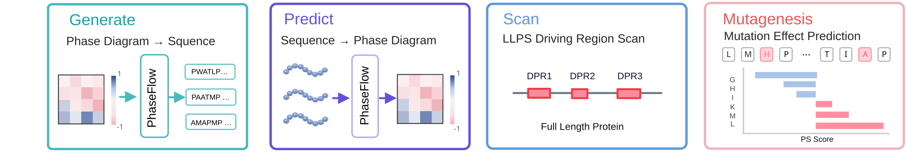
</p>

PhaseFlow supports a connected set of phase-separation applications: designing
peptide sequences from target phase diagrams, predicting phase diagrams from
candidate sequences, scanning proteins for LLPS-driving regions,
and estimating mutation effects on phase-separation behavior. These workflows
share the same sequence-phase modeling foundation while exposing outputs that
map naturally to peptide design, protein annotation, and mutagenesis analysis.

## Unified Model Architecture

### Short-Peptide Sequence-Phase Generator

<p align="center">
  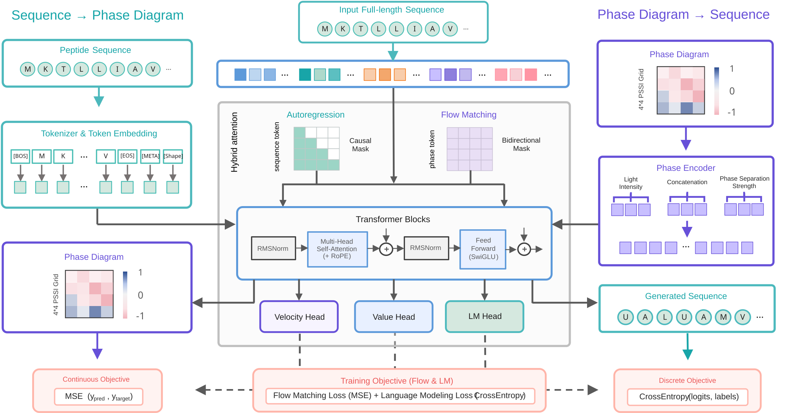
</p>

The short-peptide module is the bidirectional sequence-phase model. For
sequence-to-phase prediction, peptide tokens and phase-grid tokens pass through
shared Transformer blocks and a Flow Matching velocity head to predict a 4x4
PSSI diagram. For phase-to-sequence design, the same architecture conditions on
the target phase diagram and uses causal language modeling to generate peptide
sequences.

### Protein LLPS And DPR Model

<p align="center">
  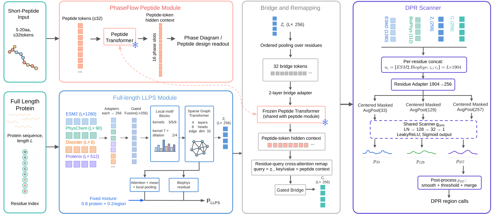
</p>

The protein module handles protein-scale context separately from the
short-peptide task. It combines residue-level ESM2, physicochemical, disorder,
structure-derived, graph, and local-context features, then bridges peptide
sequence-phase knowledge through ordered bridge tokens and residue-query
cross-attention. The outputs are protein-level LLPS probability and DPR scanner
profiles that are post-processed into droplet-promoting region calls.

<br>

## Why Use PhaseFlow?

You should consider PhaseFlow when your phase-separation workflow needs:

<table>
  <tr>
    <td align="center">🧬</td>
    <td><b>Unified multi-modal generative model</b></td>
    <td>Brings sequence, phase-diagram, residue-context, structure-derived, graph, LLPS, DPR, and mutation-effect signals into one PhaseFlow workflow.</td>
  </tr>
  <tr>
    <td align="center">🧪</td>
    <td><b>Multi-scale LLPS modeling</b></td>
    <td>Covers short-peptide phase diagrams, protein LLPS, DPR localization, and mutation-effect scoring.</td>
  </tr>
  <tr>
    <td align="center">🔁</td>
    <td><b>Bidirectional peptide model</b></td>
    <td>Learns mappings between amino-acid sequences and 4x4 phase-separation score index (PSSI) diagrams.</td>
  </tr>
  <tr>
    <td align="center">⚡</td>
    <td><b>Flow Matching for phase diagrams</b></td>
    <td>Supports faster phase-conditioned peptide design loops than diffusion-style sampling.</td>
  </tr>
  <tr>
    <td align="center">🔎</td>
    <td><b>Protein LLPS and DPR scanning</b></td>
    <td>Predicts protein-level LLPS propensity and localizes droplet-promoting regions from residue context.</td>
  </tr>
  <tr>
    <td align="center">🌉</td>
    <td><b>Staged transfer bridge</b></td>
    <td>Transfers short-peptide sequence-phase knowledge to proteins through 32 ordered bridge tokens.</td>
  </tr>
  <tr>
    <td align="center">🧫</td>
    <td><b>Mutation-effect scoring</b></td>
    <td>Amino-acid perturbations can be scored for predicted shifts in phase-separation behavior.</td>
  </tr>
  <tr>
    <td align="center">🧠</td>
    <td><b>Rich protein features</b></td>
    <td>Combines ESM2, physicochemical, disorder, Protenix-derived, graph, and residue-context signals.</td>
  </tr>
  <tr>
    <td align="center">📦</td>
    <td><b>Artifact-ready layout</b></td>
    <td>Code, configs, docs, figures, local datasets, and local model downloads are separated so GitHub stays lightweight while Hugging Face artifacts can be added cleanly.</td>
  </tr>
</table>

<br>

## Key Results

The values below are summarized from the tracked configs, audit reports, and
figure artifacts in this repository. They are included to make the README
useful as a project entry point; detailed provenance remains in
`configs/protein/` and `docs/protein/`.

| Task | Evaluation setting | PhaseFlow result |
| --- | --- | --- |
| Protein LLPS | PPMC full panel | AUPRC 0.752, AUROC 0.874 |
| Protein LLPS | threshold 0.5 | MCC 0.549, F1 0.676 |
| Peptide phase prediction | complete held-out peptide diagrams | Spearman 0.4168, Pearson 0.4219, MSE 0.5652 |
| Flow Matching vs DDPM | matched peptide phase-grid comparison | mean Spearman 0.559 vs 0.277; MSE 0.570 vs 1.315 |
| DPR localization | PhasePro, p257 readout | residue AUPRC 0.712, top-5 enrichment 1.813 |
| DPR region calling | IoU 0.25 region matching | recall 0.580, precision 0.638, segment F1 0.608 |
| Mutation effects | TDP-43 point-mutation panels | strongest average ranking/classification metrics among compared methods in the included benchmark summary |

<br>

## Key Modules

| Module | Path | Description |
| --- | --- | --- |
| Peptide core package | `phaseflow/` | Tokenizer, peptide Transformer, Flow Matching/DDPM model, utilities |
| Protein package | `phaseflow/protein/` | Protein model structure, data contracts, reusable feature/structure functions, objectives, metrics, and post-processing |
| Peptide configs | `configs/peptide/` | Lightweight peptide training defaults |
| Protein configs | `configs/protein/` | LLPS and DPR training configurations |
| Peptide scripts | `scripts/peptide/` | Training, inference, resume, and experiment launchers |
| Protein scripts | `scripts/protein/` | Reproduction workflows for data construction, training, evaluation, release validation, and benchmark utilities |
| Examples | `examples/` | Small peptide demo inputs and phase-to-sequence example |
| Tests | `tests/` | Peptide smoke tests and focused protein tests |
| Figures | `figures/` | Curated README and paper-result figures |
| Research workflows | `research/` | Short-peptide experiments and analysis scripts |
| Local artifacts | `artifacts/` | Placeholder for local datasets, model downloads, and curated result artifacts |

<br>

<details>
<summary><kbd>Table of Contents</kbd></summary>

<br>

- [Model Overview](#model-overview)
- [Application](#application)
- [Unified Model Architecture](#unified-model-architecture)
- [Why Use PhaseFlow?](#why-use-phaseflow)
- [Key Results](#key-results)
- [Key Modules](#key-modules)
- [Public Resources](#public-resources)
- [Quick Start](#quick-start)
- [Installation](#installation)
- [Repository Layout](#repository-layout)
- [Models And Datasets](#models-and-datasets)
- [Short-Peptide Usage](#short-peptide-usage)
- [Protein Usage](#protein-usage)
- [Evaluation And Checks](#evaluation-and-checks)
- [Input And Output Formats](#input-and-output-formats)
- [Artifact Policy](#artifact-policy)
- [Figures](#figures)
- [Citation](#citation)
- [License](#license)

<br>

</details>

<br>

## Public Resources

| Resource | Link | Purpose |
| --- | --- | --- |
| Source code | [GitHub: kevinhyj/PhaseFlow](https://github.com/kevinhyj/PhaseFlow) | Installation, workflows, configurations, and documentation |
| Unified checkpoint | [Hugging Face: GENTEL-Lab/PhaseFlow](https://huggingface.co/GENTEL-Lab/PhaseFlow) | Combined peptide, full-protein, and DPR runtime weights |
| Training data | [Hugging Face: GENTEL-Lab/OpenPhase](https://huggingface.co/datasets/GENTEL-Lab/OpenPhase) | Public peptide, LLPS, and DPR research-data packages |
| Online demo | [phaseflow.bio](http://phaseflow.bio/) | Interactive PhaseFlow usage |

## Quick Start

Install the source package:

```bash
git clone <your-phaseflow-repo-url>
cd PhaseFlow
conda env create -f environment.yml
conda activate phaseflow
python -m pip install -e .
python -c "import phaseflow; print(phaseflow.__version__)"
```

Download the public training data and the combined runtime checkpoint:

```bash
huggingface-cli download GENTEL-Lab/OpenPhase \
  --repo-type dataset \
  --local-dir artifacts/data/peptide

hf download GENTEL-Lab/PhaseFlow PhaseFlow.pt \
  --local-dir artifacts/models
```

Run peptide sequence-to-phase inference:

```bash
bash scripts/peptide/infer.sh \
  artifacts/models/peptide/best_model.pt \
  examples/sequences.txt \
  artifacts/results/peptide/predicted_phases.csv \
  0
```

The training data are hosted at
[`GENTEL-Lab/OpenPhase`](https://huggingface.co/datasets/GENTEL-Lab/OpenPhase).
The [combined PhaseFlow runtime checkpoint](https://huggingface.co/GENTEL-Lab/PhaseFlow)
contains peptide, full-protein, and DPR weights. It is intended for the
combined runtime; the standalone peptide scripts below still expect a
peptide-only `best_model.pt` checkpoint.

## Installation

### Local source install

```bash
conda env create -f environment.yml
conda activate phaseflow
python -m pip install -e .
```

Install optional protein and test dependencies:

```bash
python -m pip install -e ".[protein,test]"
```

Install optional feature-generation dependencies:

```bash
python -m pip install -e ".[plm,starling]"
```

The default source install is intended for code reuse, peptide workflows, and
lightweight checks. Protein reproduction requires external data, feature
stores, and model checkpoints that are not committed to Git.

## Repository Layout

```text
phaseflow/                 Peptide and protein packages
phaseflow/protein/         Protein model structure and reusable core components
configs/peptide/           Short-peptide configs
configs/protein/       Protein LLPS and DPR configs
docs/peptide/              Short-peptide documentation
docs/protein/          Protein documentation and audit reports
scripts/peptide/           Short-peptide training and inference launchers
scripts/protein/       Protein reproduction workflows and command adapters
scripts/protein/analysis/      Protein benchmark and threshold analyses
scripts/protein/inference/     Standalone protein DPR inference
tests/peptide/             Short-peptide smoke tests
tests/protein/         Protein focused tests
examples/                  Short-peptide demo inputs
scripts/peptide/workflows/     Short-peptide training, inference, and evaluation entry points
scripts/peptide/analysis/      Short-peptide analysis scripts
artifacts/results/peptide/     Curated short-peptide analysis outputs
artifacts/results/protein/     Protein publication results and renderers
figures/peptide/           Short-peptide figures
figures/protein/       Protein LLPS/DPR figures
artifacts/data/            Local datasets and generated feature stores
artifacts/models/          Local model checkpoints downloaded from Hugging Face
artifacts/results/         Lightweight curated result artifacts
```

## Models And Datasets

Large artifacts are intentionally separated from the source repository.

Suggested local layout:

```text
artifacts/data/
  peptide/                 Phase-diagram CSV/NPZ data and split files
  protein/                 Manifests, feature stores, benchmark inputs
artifacts/models/
  PhaseFlow.pt             Combined peptide, full-protein, and DPR checkpoint
  peptide/                 Optional standalone peptide-only checkpoints
```

Public peptide training-data download:

```bash
huggingface-cli download GENTEL-Lab/OpenPhase \
  --repo-type dataset \
  --local-dir artifacts/data/peptide

hf download GENTEL-Lab/PhaseFlow PhaseFlow.pt \
  --local-dir artifacts/models
```

| Resource | Local target | Status |
| --- | --- | --- |
| OpenPhase training data | `artifacts/data/peptide/` | [Available on Hugging Face](https://huggingface.co/datasets/GENTEL-Lab/OpenPhase) |
| Protein feature/data bundle | `artifacts/data/protein/` | Not yet released |
| Combined peptide, full-protein, and DPR checkpoint | `artifacts/models/PhaseFlow.pt` | [Available on Hugging Face](https://huggingface.co/GENTEL-Lab/PhaseFlow) |
| Standalone peptide-only checkpoint | `artifacts/models/peptide/` | Not yet released |

## Short-Peptide Usage

### Train

```bash
bash scripts/peptide/train.sh \
  --config configs/peptide/peptide.yaml \
  --data artifacts/data/peptide/phase_diagram_original_scale.csv \
  --output-dir outputs/peptide \
  --gpu 0 \
  --foreground
```

### Predict phase diagrams from sequences

```bash
bash scripts/peptide/infer.sh \
  artifacts/models/peptide/best_model.pt \
  examples/sequences.txt \
  artifacts/results/peptide/predicted_phases.csv \
  0
```

### Generate sequences from target phase diagrams

```bash
python examples/phase2seq_demo.py \
  --checkpoint artifacts/models/peptide/best_model.pt \
  --input_csv artifacts/data/peptide/test_set.csv \
  --num_samples 5
```

### Evaluate peptide models

```bash
python scripts/peptide/workflows/evaluate_seq2phase.py \
  --test_path artifacts/data/peptide/test_set.csv \
  --models_dir outputs/peptide
```

## Protein Usage

The protein code is packaged under `phaseflow.protein`. It expects
downloaded model checkpoints and feature/data bundles under `artifacts/models/protein/`
and `artifacts/data/protein/`.

Protein training configurations:

- `configs/protein/llps.yaml`
- `configs/protein/dpr.yaml`

### IDR sliding-window peptide PhaseFlow helper

```bash
python scripts/protein/inference/predict_protein_dpr.py \
  --input artifacts/data/protein/idr_sequences.xlsx \
  --checkpoint artifacts/models/peptide/best_model.pt \
  --output runs/protein/idr_phaseflow_profiles.jsonl \
  --csv runs/protein/idr_phaseflow_profiles.csv
```

### DPR training entry point

```bash
torchrun --nproc_per_node=8 scripts/protein/run.py train-dpr \
  --config configs/protein/dpr.yaml \
  --arm dpr \
  --updates 50 \
  --output-root runs/dpr
```

This command requires the protein data package, reconstructed feature
stores, and checkpoints referenced by the config.

### Protein figures

```bash
python artifacts/results/protein/scripts/figures/plot_llps_benchmark.py --help
python artifacts/results/protein/scripts/figures/plot_dpr_benchmark.py --help
python artifacts/results/protein/scripts/figures/plot_model_architecture.py \
  --output-dir runs/figures/protein
```

## Evaluation And Checks

Short-peptide checks:

```bash
python -m compileall phaseflow scripts/peptide examples tests/peptide
python -m unittest discover tests/peptide
```

Protein checks:

```bash
python -m compileall phaseflow/protein scripts/protein tests/protein
python -m pytest tests/protein/test_imports.py tests/protein/test_phaseflow_fusion.py
```

Install test dependencies if `pytest` is unavailable:

```bash
python -m pip install -e ".[test]"
```

## Input And Output Formats

### Peptide sequence input

`scripts/peptide/infer.sh` accepts a text file with one amino-acid sequence per
line, or the underlying Python script can read a CSV column named
`AminoAcidSequence`.

```text
ACDEFGHIKLMNPQRSTVWY
GGGGGSSSSSQQQQQNNNNN
```

### Peptide phase output

Sequence-to-phase inference writes a CSV with the sequence and 16 PSSI columns:

```text
AminoAcidSequence,group_11,group_12,...,group_44
ACDEFGHIKLMNPQRSTVWY,0.12,-0.08,...,0.31
```

### Protein IDR helper output

The IDR helper writes JSONL profiles and an optional compact CSV:

```json
{"id":"IDR_000","length":120,"window_sizes":[20],"pssi_mean":0.14}
```

## Artifact Policy

Git tracks code, configs, docs, tests, and curated lightweight figures/results.
It does not track raw datasets, generated feature stores, model checkpoints,
training logs, or large runtime outputs.

Local artifact paths:

- `artifacts/data/peptide/` and `artifacts/data/protein/` for datasets and feature stores.
- `artifacts/models/peptide/` and `artifacts/models/protein/` for Hugging Face model downloads.
- `outputs/` and `logs/` for regenerated training or inference outputs.

The repository `.gitignore` excludes common checkpoint formats such as `.pt`,
`.pth`, `.ckpt`, and `.safetensors`, and also ignores local model files under
`artifacts/models/`.

## Figures

### Protein LLPS

<table>
  <tr>
    <td align="center" width="50%">
      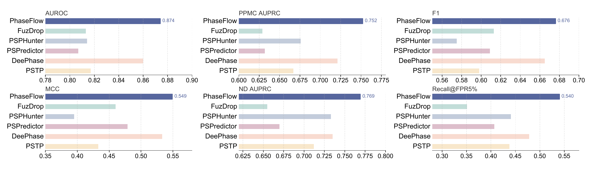
      <br><i>Protein-level LLPS benchmark.</i>
    </td>
    <td align="center" width="50%">
      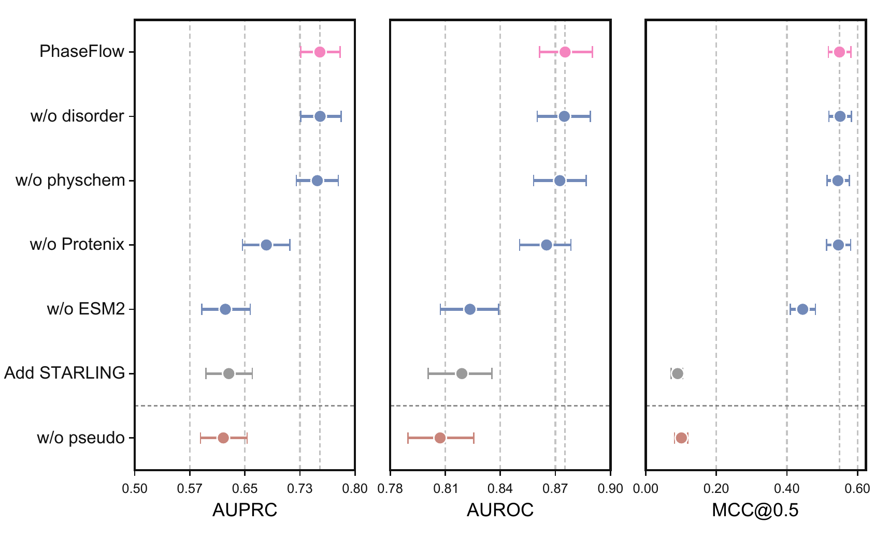
      <br><i>Input-stream and weak-supervision ablations.</i>
    </td>
  </tr>
</table>

### DPR Localization

<table>
  <tr>
    <td align="center" width="50%">
      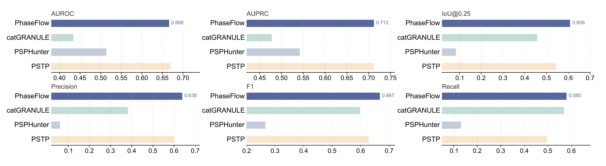
      <br><i>Residue- and region-level DPR benchmark.</i>
    </td>
    <td align="center" width="50%">
      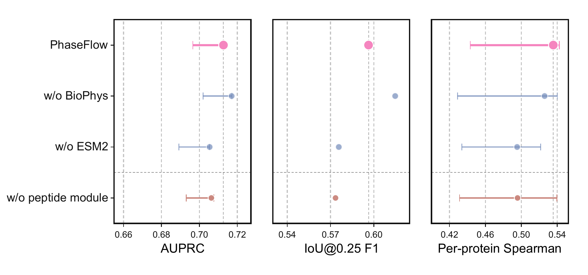
      <br><i>DPR scanner input and bridge ablations.</i>
    </td>
  </tr>
</table>

<p align="center">
  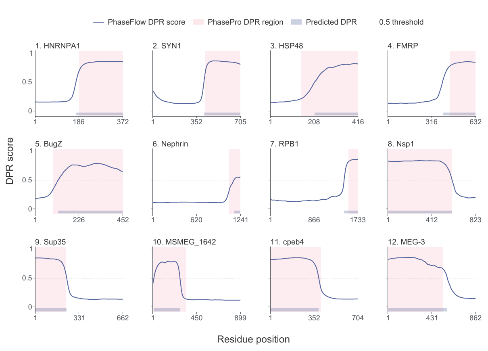
  <br><i>Representative DPR profiles on PhasePro proteins.</i>
</p>

### Peptide Phase Prediction And Design

<table>
  <tr>
    <td align="center" width="50%">
      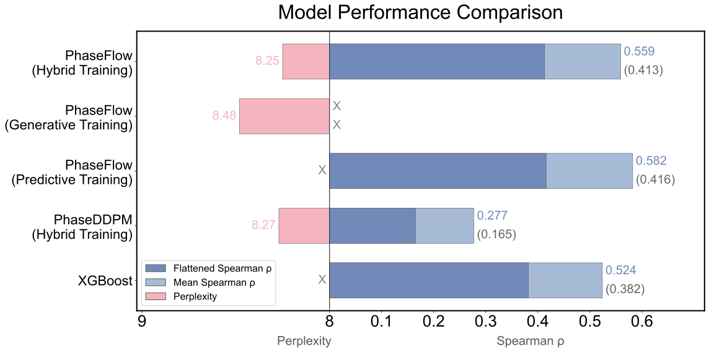
      <br><i>Flow Matching and DDPM phase-diagram comparison.</i>
    </td>
    <td align="center" width="50%">
      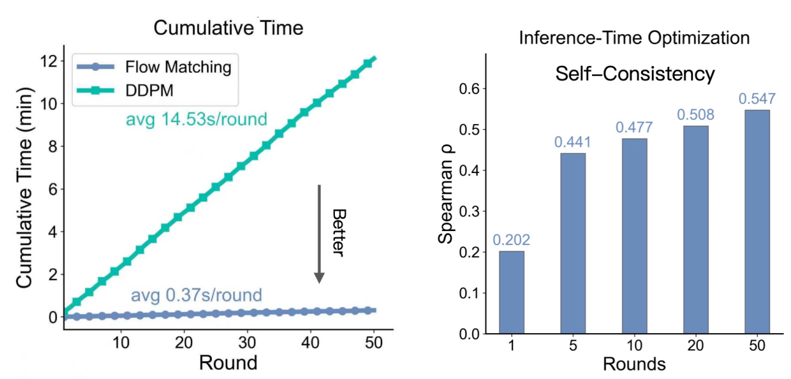
      <br><i>Phase-conditioned generation and rescoring loop.</i>
    </td>
  </tr>
  <tr>
    <td align="center" width="50%">
      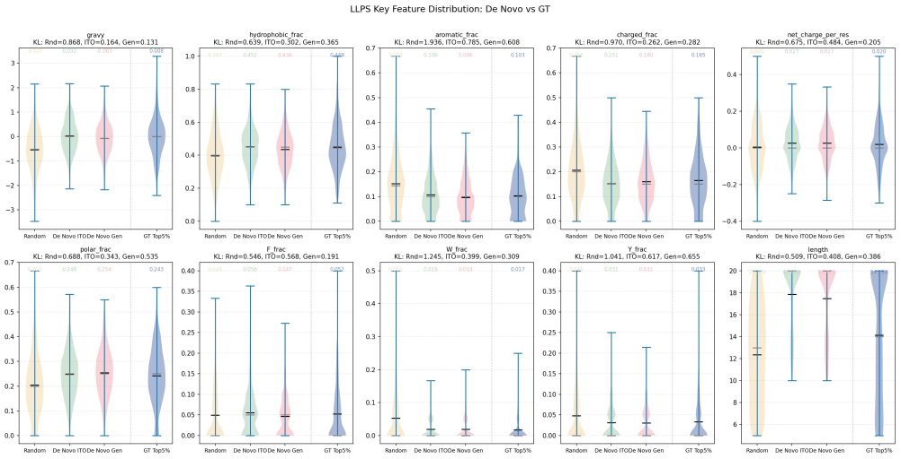
      <br><i>Generated high-tendency peptide candidates.</i>
    </td>
    <td align="center" width="50%">
      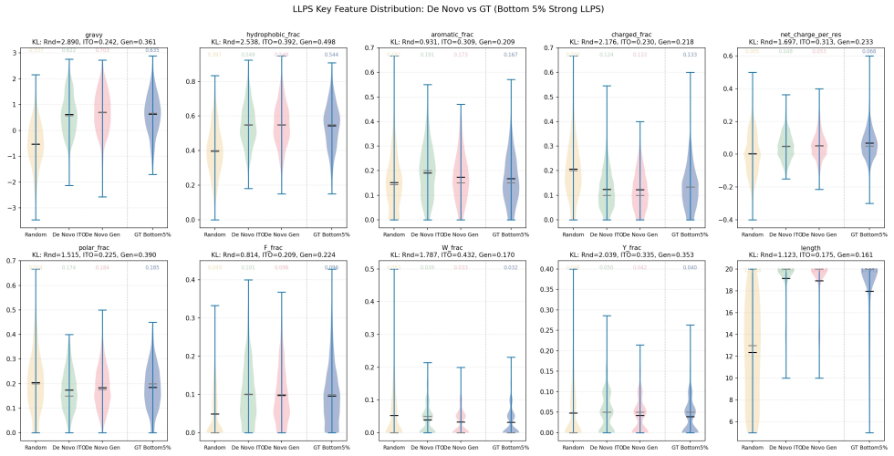
      <br><i>Generated low-tendency peptide candidates.</i>
    </td>
  </tr>
</table>

### Mutation Effects

<table>
  <tr>
    <td align="center" width="50%">
      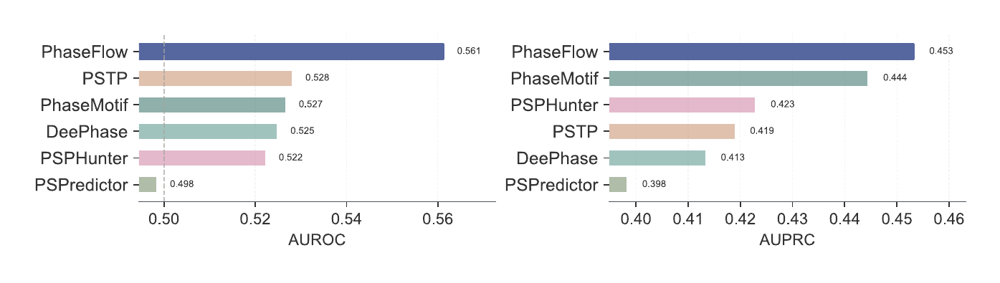
      <br><i>TDP-43 point-mutation benchmark summary.</i>
    </td>
    <td align="center" width="50%">
      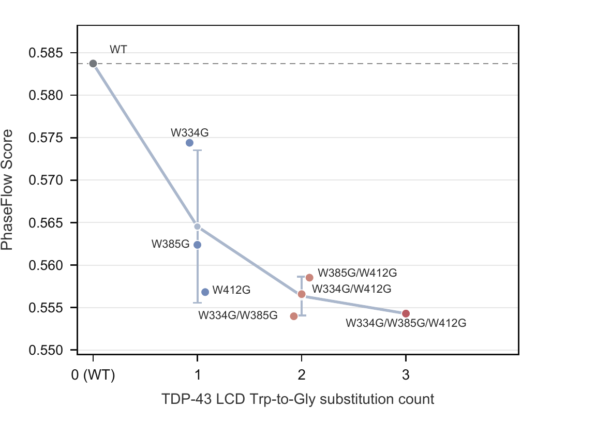
      <br><i>Within-panel W-to-G multi-mutant trend.</i>
    </td>
  </tr>
</table>

## Citation

Citation information will be added after the public manuscript and artifact
release are finalized.

## License

This project is licensed under the Apache License, Version 2.0. See
[`LICENSE`](LICENSE) for details.
